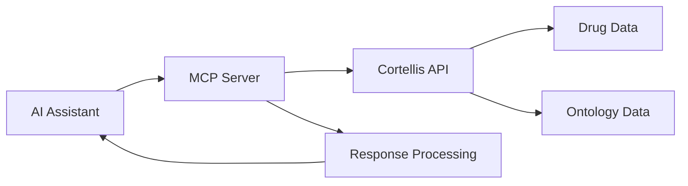

# Cortellis MCP Server

<!-- Project Status -->
[](https://opensource.org/licenses/MIT)
[](https://github.com/uh-joan/mcp-cortellis)
[](https://github.com/uh-joan/mcp-cortellis/tree/main/docs)
[](https://github.com/uh-joan/mcp-cortellis)

<!-- Package Info -->
[](https://pypi.org/project/cortellis-mcp/)
[](https://pypi.org/project/cortellis-mcp/)
[](https://pypi.org/project/cortellis-mcp/)
[](https://pypi.org/project/cortellis-mcp/)

<!-- Technology Stack -->
[](https://www.python.org/downloads/)
[](https://github.com/uh-joan/mcp-cortellis/blob/main/Dockerfile)
[](https://github.com/astral-sh/ruff)

<!-- Platform Support -->
[](https://github.com/uh-joan/mcp-cortellis)
[](https://github.com/uh-joan/mcp-cortellis)

<!-- Repository Activity -->
[](https://github.com/uh-joan/mcp-cortellis/stargazers)
[](https://github.com/uh-joan/mcp-cortellis/commits/main)
[](https://github.com/uh-joan/mcp-cortellis/issues)
[](https://github.com/uh-joan/mcp-cortellis/pulls)
[](CONTRIBUTING.md)

A production-ready MCP server enabling AI assistants to search and analyze pharmaceutical data through Cortellis. Features comprehensive drug search, ontology exploration, and real-time clinical trial data access.

Perfect for drug discovery, clinical trial analysis, and pharmaceutical market research, this server enables natural language interactions for complex pharmaceutical queries.

## Features

- 🔍 **Comprehensive Drug Search**
  - Search by indication, phase, company, and more
  - Real-time access to drug development statuses
  - Detailed pharmaceutical data retrieval

- 🧬 **Ontology Exploration**
  - Explore standardized medical terminology
  - Navigate drug classifications
  - Discover relationships between terms

- 🔐 **Secure Authentication**
  - Environment-based credential management
  - Secure API communication
  - Rate limiting and request validation

- 🛠 **Developer-Friendly**
  - Clear API documentation
  - Example scripts and use cases
  - Easy integration with AI assistants

## Architecture



## Prerequisites

- Python 3.10 or higher
- uv package manager (recommended) or pip
- Cortellis API credentials

## Installation

### From PyPI (Recommended)

```bash
# Using pip
pip install cortellis-mcp

# Using uv
uv pip install cortellis-mcp
```

### Local Installation (Development)

1. Clone the repository:
```bash
git clone https://github.com/uh-joan/mcp-cortellis.git
cd mcp-cortellis
```

2. Install the package:
```bash
# Using uv (recommended)
uv venv
source .venv/bin/activate  # On Unix/macOS
# or
.venv\Scripts\activate  # On Windows
uv pip install -e .

# Or using pip
python -m venv .venv
source .venv/bin/activate  # On Unix/macOS
# or
.venv\Scripts\activate  # On Windows
pip install -e .
```

3. Set up your environment variables:
```bash
# In your .env file
CORTELLIS_USERNAME=your_username
CORTELLIS_PASSWORD=your_password
```

### Alternative: Install from GitHub

If you just want to use the package without development:

```bash
# Using uv
uv pip install git+https://github.com/uh-joan/mcp-cortellis.git

# Or using pip
pip install git+https://github.com/uh-joan/mcp-cortellis.git
```

## Using with Cursor IDE

Add the following to your `.cursor/settings.json`:
```json
{
  "mcps": {
    "cortellis": {
      "command": ["python", "-m", "cortellis_mcp"],
      "env": {
        "CORTELLIS_USERNAME": "your_username",
        "CORTELLIS_PASSWORD": "your_password"
      }
    }
  }
}
```

After restarting Cursor, you can use natural language prompts like:
- "Search for drugs targeting obesity in phase 3"
- "Find all launched drugs by Novo Nordisk"
- "Explore ontology terms related to glucagon"

## Quick Start

```python
from cortellis_mcp import search_drugs, explore_ontology

# Search for Phase 3 obesity drugs
results = search_drugs(
    indication="obesity",
    phase="C3"  # Phase 3 Clinical
)

# Explore ontology terms
terms = explore_ontology(
    category="indication",
    term="diabetes"
)
```

Check the [examples](examples/) directory for more usage examples.

## API Reference

See the [API documentation](docs/API.md) for detailed function references.

### Development Status Codes

When searching for drugs, you can use these phase codes:
- `S`: Suspended
- `DR`: Discovery/Preclinical
- `CU`: Clinical (unknown phase)
- `C1`: Phase 1 Clinical
- `C2`: Phase 2 Clinical
- `C3`: Phase 3 Clinical
- `PR`: Pre-registration
- `R`: Registered
- `L`: Launched
- `OL`: Outlicensed
- `NDR`: No Development Reported
- `DX`: Discontinued
- `W`: Withdrawn

## Development

For development work, follow the [Local Installation](#local-installation-recommended) instructions above, which will install the package in editable mode (`-e` flag).

## License

This project is licensed under the MIT License - see the [LICENSE](LICENSE) file for details.

## Security Considerations

- API credentials are stored securely in environment variables
- All requests are authenticated and validated
- Rate limiting is enforced to prevent abuse
- HTTPS encryption for all API communications
- Regular security audits and updates

## Categories

- Research & Data
- Health & Wellness
- Developer Tools
- API Integration

## Contributing

Contributions are welcome! Please read our [Contributing Guidelines](CONTRIBUTING.md) before submitting changes.

## Support

- 📚 [Documentation](docs/API.md)
- 💬 [GitHub Issues](https://github.com/uh-joan/mcp-cortellis/issues)
- 📧 [Email Support](mailto:janisaez@gmail.com)